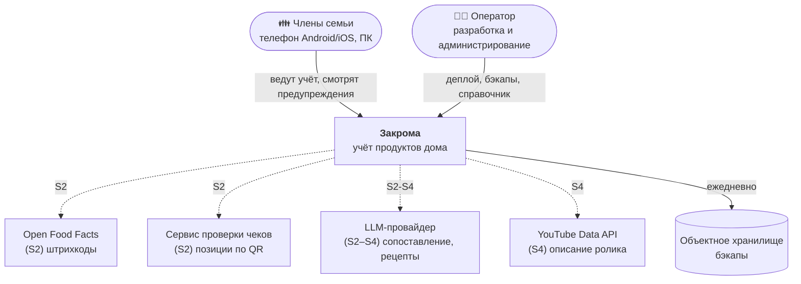
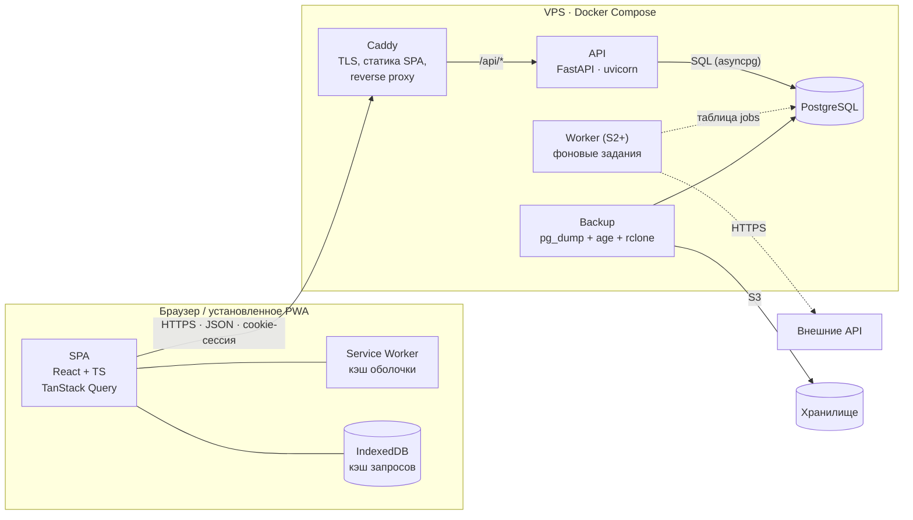

# Контекст и контейнеры (C4)

## Уровень 1 — контекст

```mermaid
flowchart TB
    family(["👪 Члены семьи<br/>телефон Android/iOS, ПК"])
    operator(["🧑‍💻 Оператор<br/>разработка и администрирование"])
    zk["<b>Закрома</b><br/>учёт продуктов дома"]
    off["Open Food Facts<br/>(S2) штрихкоды"]
    fns["Сервис проверки чеков<br/>(S2) позиции по QR"]
    llm["LLM-провайдер<br/>(S2–S4) сопоставление, рецепты"]
    yt["YouTube Data API<br/>(S4) описание ролика"]
    s3[("Объектное хранилище<br/>бэкапы")]

    family -->|"ведут учёт, смотрят предупреждения"| zk
    operator -->|"деплой, бэкапы, справочник"| zk
    zk -.->|S2| off
    zk -.->|S2| fns
    zk -.->|S2-S4| llm
    zk -.->|S4| yt
    zk -->|"ежедневно"| s3
```

## Уровень 2 — контейнеры

```mermaid
flowchart LR
    subgraph browser["Браузер / установленное PWA"]
        spa["SPA<br/>React + TS<br/>TanStack Query"]
        sw["Service Worker<br/>кэш оболочки"]
        idb[("IndexedDB<br/>кэш запросов")]
        spa --- sw
        spa --- idb
    end

    subgraph server["VPS · Docker Compose"]
        caddy["Caddy<br/>TLS, статика SPA,<br/>reverse proxy"]
        api["API<br/>FastAPI · uvicorn"]
        worker["Worker (S2+)<br/>фоновые задания"]
        db[("PostgreSQL")]
        backup["Backup<br/>pg_dump + age + rclone"]
    end

    spa -->|"HTTPS · JSON · cookie-сессия"| caddy
    caddy -->|"/api/*"| api
    api -->|"SQL (asyncpg)"| db
    worker -.->|"таблица jobs"| db
    worker -.->|"HTTPS"| ext["Внешние API"]
    backup --> db
    backup -->|"S3"| s3[("Хранилище")]
```
