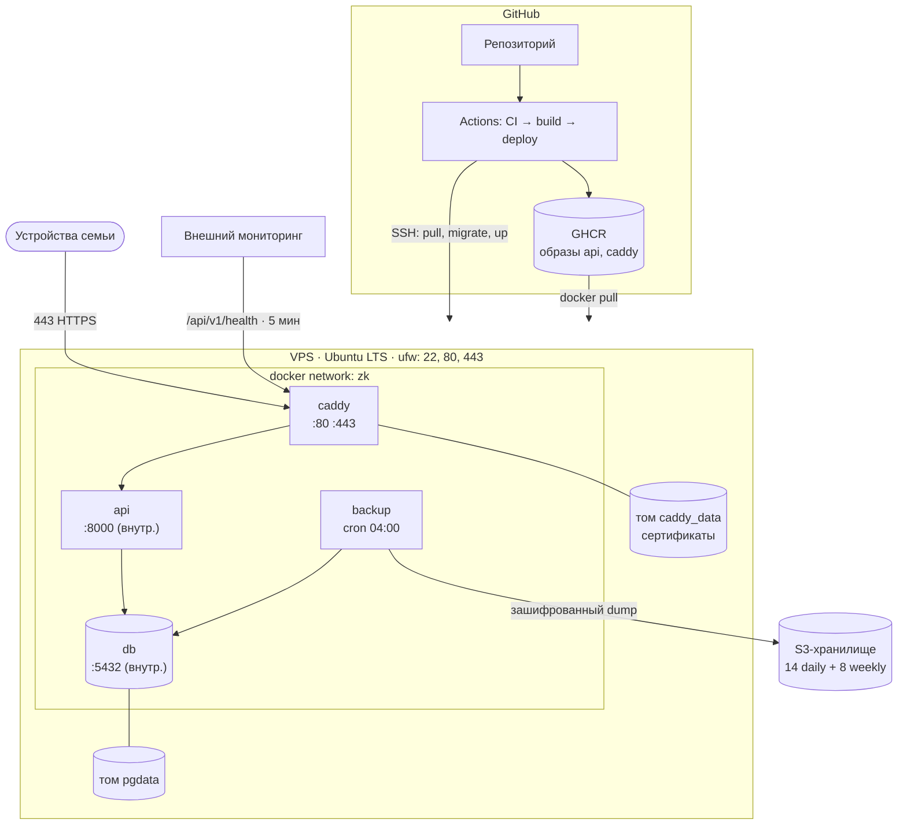
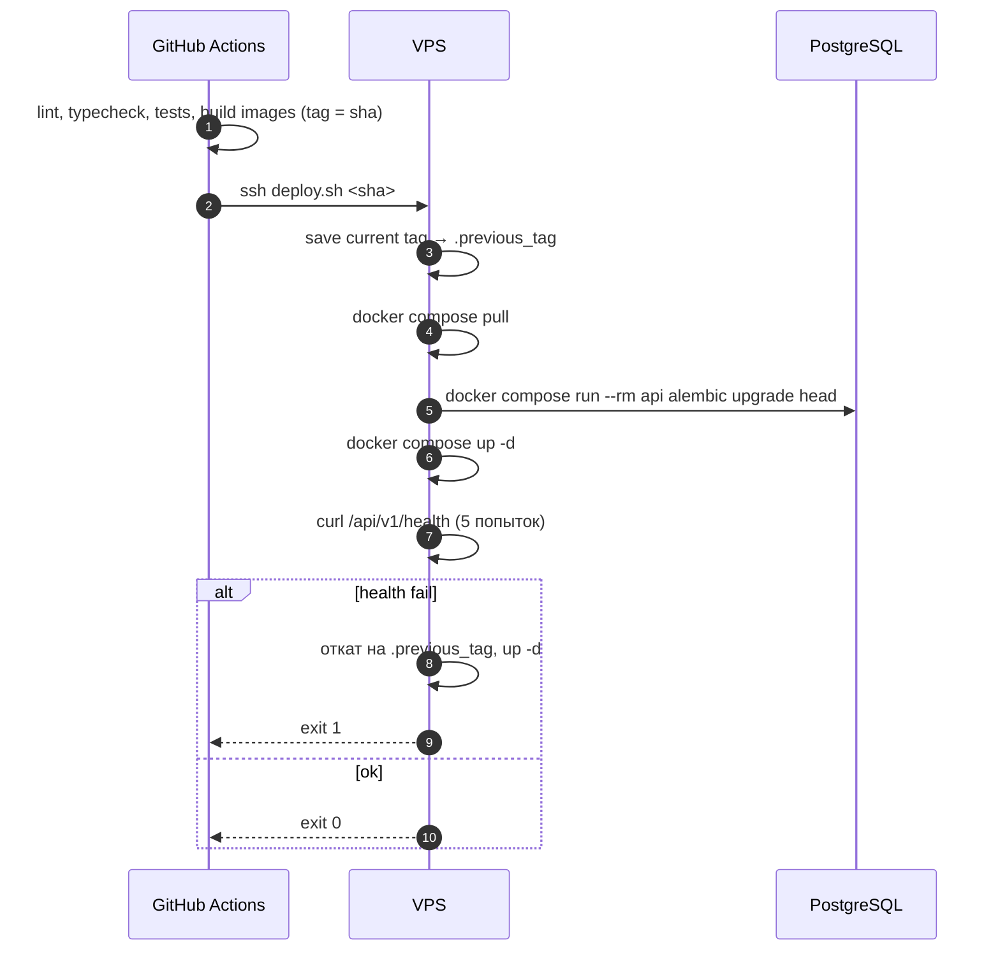

# Развёртывание

```mermaid
flowchart TB
    subgraph gh["GitHub"]
        repo["Репозиторий"]
        actions["Actions: CI → build → deploy"]
        ghcr[("GHCR<br/>образы api, caddy")]
        repo --> actions --> ghcr
    end

    subgraph vps["VPS · Ubuntu LTS · ufw: 22, 80, 443"]
        direction TB
        subgraph net["docker network: zk"]
            caddy["caddy<br/>:80 :443"]
            api["api<br/>:8000 (внутр.)"]
            db[("db<br/>:5432 (внутр.)")]
            backup["backup<br/>cron 04:00"]
        end
        vol1[("том pgdata")]
        vol2[("том caddy_data<br/>сертификаты")]
        db --- vol1
        caddy --- vol2
        caddy --> api --> db
        backup --> db
    end

    users(["Устройства семьи"]) -->|"443 HTTPS"| caddy
    actions -->|"SSH: pull, migrate, up"| vps
    ghcr -->|"docker pull"| vps
    backup -->|"зашифрованный dump"| s3[("S3-хранилище<br/>14 daily + 8 weekly")]
    ping["Внешний мониторинг"] -->|"/api/v1/health · 5 мин"| caddy
```

Порядок деплоя:

```mermaid
sequenceDiagram
    autonumber
    participant GA as GitHub Actions
    participant V as VPS
    participant DB as PostgreSQL
    GA->>GA: lint, typecheck, tests, build images (tag = sha)
    GA->>V: ssh deploy.sh <sha>
    V->>V: save current tag → .previous_tag
    V->>V: docker compose pull
    V->>DB: docker compose run --rm api alembic upgrade head
    V->>V: docker compose up -d
    V->>V: curl /api/v1/health (5 попыток)
    alt health fail
        V->>V: откат на .previous_tag, up -d
        V-->>GA: exit 1
    else ok
        V-->>GA: exit 0
    end
```
